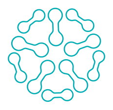

<p align="center">
    <a href="https://www.rankai.com/">
        
    </a>
    <br/>
    <br/>
    <a href="https://flutter.dev/docs/get-started/install">
        
    </a>
    <a href="https://flutter.dev/docs/get-started/install">
        
    </a>
</p>

## Project Overview

This project was developed using Flutter version 3.19.4. You can use FVM, ASDF, or direct Flutter SDK installation.

### Setup

To prepare your development environment, clone the repository and follow the steps below based on your development setup.

#### Generate Models

To generate models using build_runner:

```shell
dart run build_runner build --delete-conflicting-outputs
```

#### Configuration Files

Place your `dev.json` file, which you should have received by email, into the following directory:

assets/config/

````

#### Running the App

To run the application on a specific environment, use one of the following commands:

```shell
flutter run --flavor dev --dart-define-from-file assets/config/dev.json
````

## Design and Architecture

A preliminary UX/UI design was created in Figma (approx. 1.5 hours of work). The design can be viewed here:

[View Figma Design](https://www.figma.com/file/5cE0Ejf1fW97x5YTjBsuMF/Labhouse?type=design&node-id=0%3A1&mode=design&t=jAQcjf8CPG74vs3G-1)

For rapid development, the architecture from a last project was reused, implementing Riverpod for state management. The app's routing is managed with go_router, and Firebase has been set up for the dev flavor.

VS Code has been used to develop the app.

Internationalization is supported with translations in both French and English.

SharedPreferences is used to store rankings requests history.

Warning: make sure your phone/simulator/emulator is connected to internet.

## Future Improvements

Although the current version is functional, numerous enhancements are possible:

- Enhanced prompt enrichment for varied ranking types and more user information
- Full page history feature
- Enhanced UX/UI, including additional animations
- Splash screen implementation
- Integration with an online translation manager like Crowdin
- In-app prompts for users to rate the app
- Subscription model for premium features
- Add a internet connection checker

### Note

Due to time constraints, a CI/CD pipeline with Fastlane for Firebase Distribution or AppCenter was not set up but is planned for future iterations.
